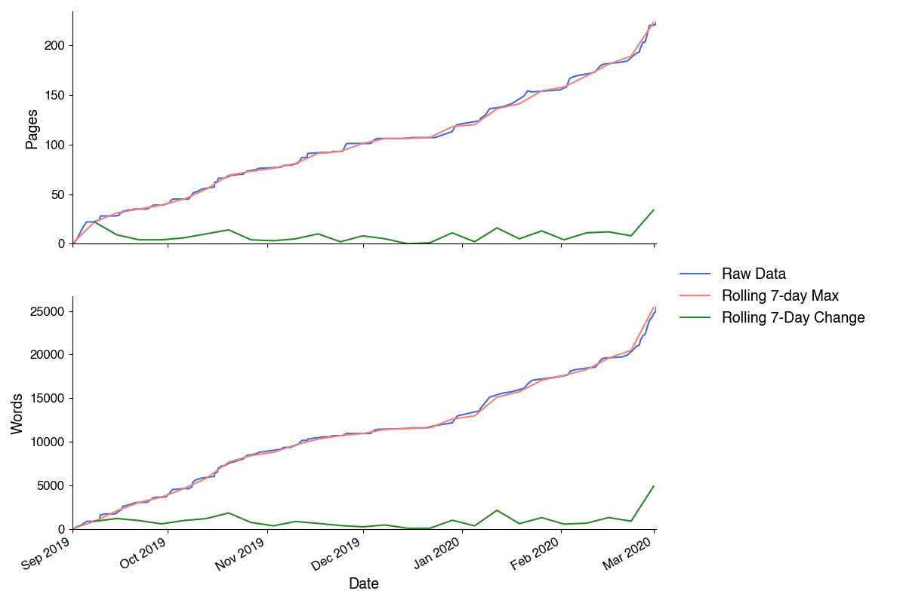
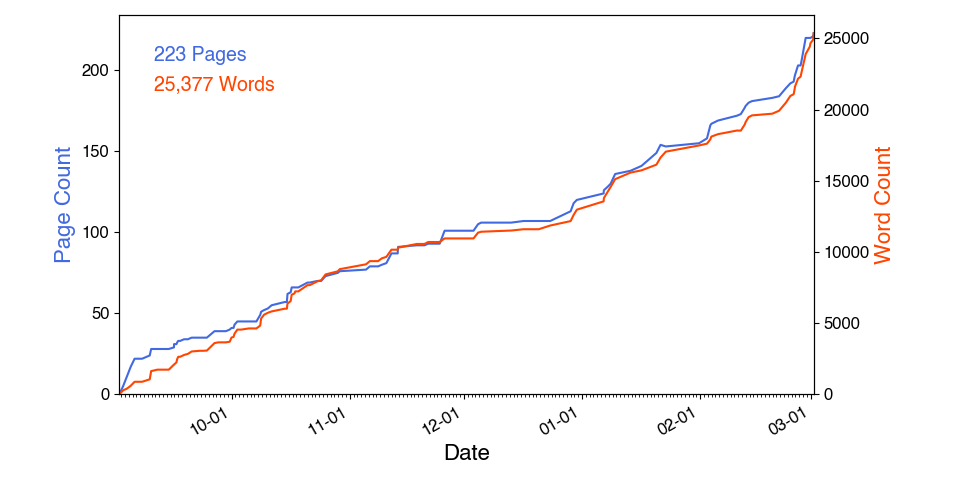

# latex-progress-tracker
### Progress tracking plots for LaTeX documents.

This tool generates plots to track the progress of LaTeX documents over time. The plot generated looks similar to the below one, I've used for my thesis...


Additionally it now outputs plots with weekly progress:



Requires python3, pandas, and matplotlib to be installed.

The tool consists of 2 files:

**updateProgress.sh** - This gets the word count and page count for the TeX document. To set up this script, you need to change the ```$TEX_DOC``` and ```$DOCUMENT``` variables to your .tex file and the output .pdf file. It will generate a .csv on the first run and then append a new line to it every time this is ran. You can run this script as you choose, or run daily as a cron job (instructions at the bottom).

**plotProgress.py** - This plots the progress of your document. It outputs progress.png, a plot of the word and page count for your document. If you'd like to add addition vertical markers for important dates, a routine for doing so is commented out in the script.

It also outputs a handy twitter-friendly version too:




## Running as a cronjob:

From a terminal run ```crontab -e``` and add the following line:

```
0 12 * * *  source path/to/directory/updateProgress.sh
```

This will run daily at noon (change the 12 if you want another time). In ```updateProgress.sh```, the top ```$PATH``` variables will have to be found (the bin and TeX directory), since it runs in a clean environment. 

